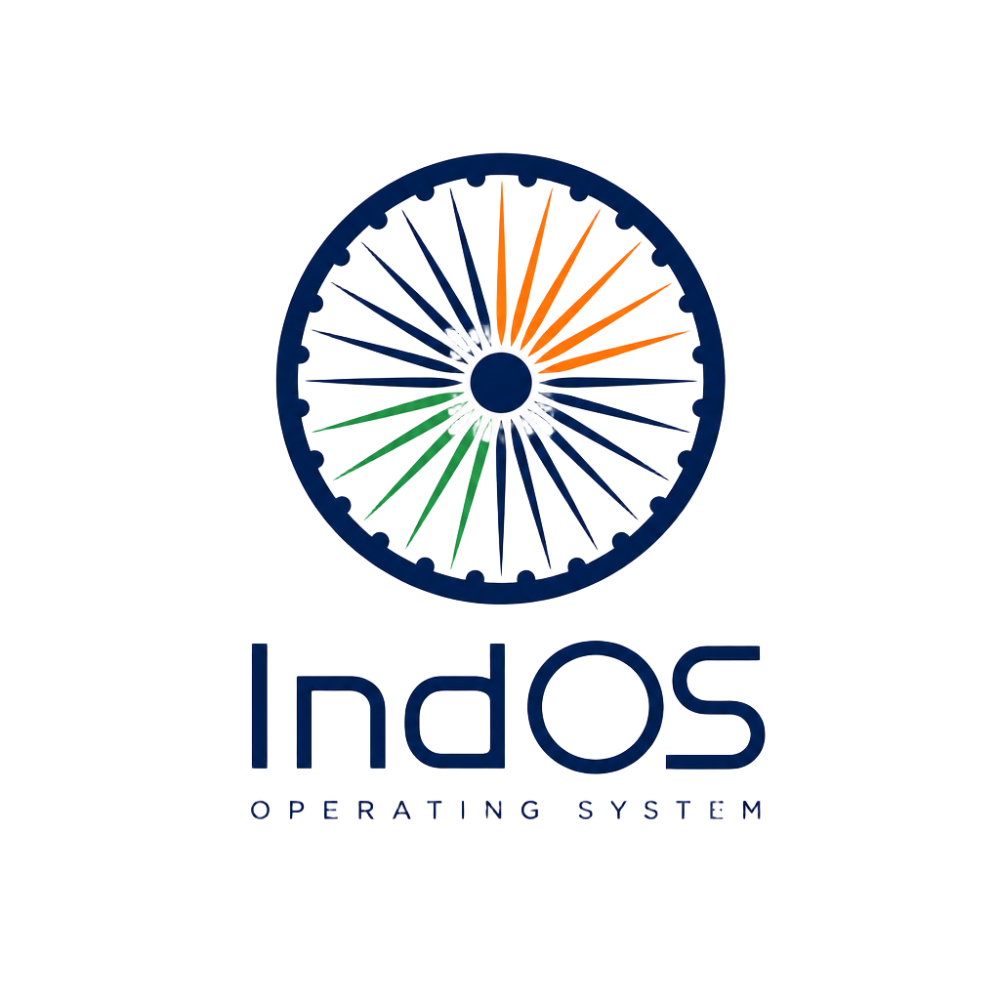

<div align="center">



# IndOS — Bharat ka apna OS

**A free, secure, Ubuntu LTS–based desktop operating system, built in India for the world.**

[](https://indos.org)
[](#)
[](https://ubuntu.com)
[](./LICENSE)
[](#supply-chain-security)
[](#supply-chain-security)

</div>

---

## Why IndOS

IndOS is a desktop OS designed from the ground up for **Indian users, Indian languages and Indian hardware** — from a 2-GB-RAM school laptop to a modern workstation. It ships with India-Stack integrations, 22 Indian languages and on-device AI, with **zero telemetry** and **encryption by default**.

- **Made for India** — UPI, DigiLocker, Aarogya Setu, 22 Indian languages, Indian keyboard layouts
- **Secure by default** — LUKS2 full-disk encryption, AppArmor, default-deny firewall, signed reproducible builds
- **Private by default** — zero telemetry, no analytics, no ads, no account required
- **On-device AI** — Ollama + TinyLlama, fully offline
- **Runs anywhere** — GNOME edition for modern hardware, XFCE edition for 2-GB-RAM laptops
- **Free forever** — source-available, no subscriptions, no upsells

## Editions

| Edition | Best for | RAM | Disk |
|---|---|---|---|
| **IndOS GNOME** | Modern laptops & desktops (2018+) | 4 GB+ | 25 GB |
| **IndOS XFCE** | Older / low-end machines, schools | 2 GB+ | 15 GB |

## Download & verify

```bash
# 1. Download the ISO and signatures from https://indos.org/download
# 2. Verify SHA-256 + GPG signature in one shot
curl -O https://indos.org/verify-indos.sh
bash verify-indos.sh indos-1.0-bharat-gnome-amd64.iso
```

See [`/security`](https://indos.org/security) for SHA-256 sums, GPG keys, SBOM and SLSA attestations.

## Supply-chain security

Every release ships with:

- **SHA-256 checksums** signed with the IndOS release key
- **CycloneDX SBOM** listing every package & version in the image
- **SLSA Level 3 build provenance** attestations (in-toto, signed with Sigstore cosign)
- **Reproducible builds** — anyone can rebuild bit-for-bit from source

## This website

The `indos.org` site lives in this repo and is built with:

- **TanStack Start** (React 19 + Vite 7, SSR on Cloudflare Workers)
- **Tailwind CSS v4** with the IndOS tricolor design system (Saffron · Cream · India Green · Navy)
- Strict **CSP / HSTS / Permissions-Policy** headers — A+ on securityheaders.com

### Run locally

```bash
bun install
bun run dev   # http://localhost:3000
```

### Project structure

```
src/
├── routes/          # File-based routes (index, features, download, security, press, …)
├── components/      # Layout + shadcn/ui primitives
├── styles.css       # Tailwind v4 + design tokens
└── start.ts         # Server middleware (security headers, error handler)
public/
└── verify-indos.sh  # ISO + GPG verification script
```

## Press & brand

Logos, colors, screenshots and boilerplate copy are at **[indos.org/press](https://indos.org/press)** and in `/public/press`. Free to use, attribution appreciated.

Press contact — **press@indos.org**

## Contributing

We welcome bug reports, translations and packaging help. Contributions to the **codebase** are accepted under the [Contributor License Agreement](./CLA.md), which grants the IndOS project the rights needed to keep the trademark and brand coherent.

- [Open an issue](https://github.com/iiamankumar/IndOS/issues)
- [Join the community](https://indos.org/community)
- [Read the docs](https://indos.org/docs)

## License

IndOS is released under the **IndOS Source-Available License 1.0** — see [LICENSE](./LICENSE).

**In plain English:**

- ✅ You can **use** IndOS freely — at home, in schools, in business, in government, anywhere.
- ✅ You can **read, audit and modify** the source for your own use.
- ✅ You can **redistribute unmodified** ISOs and source.
- ❌ You **may not** publish a derivative distribution, fork or rebrand (no "MyOS based on IndOS").
- ❌ You **may not** use the IndOS name, logo or tricolor mark for anything other than referring to IndOS itself.

This is intentionally **not** an OSI-approved open-source license. IndOS prioritises a single, coherent, trustworthy distribution for India over the right to fork. The full source is public for transparency, security review and reproducibility.

---

<div align="center">

**Built with ❤️ in India.** Jai Hind. 🇮🇳

</div>
